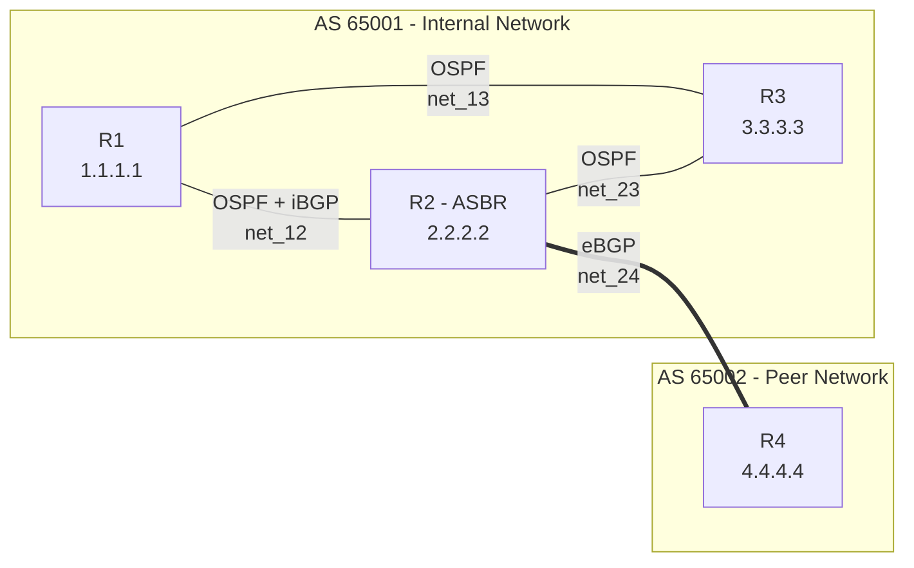

# Network Automation Lab — OSPF + BGP with FRR

A fully containerized 4-router network topology demonstrating dynamic routing protocols (OSPF + iBGP + eBGP), with Python-based monitoring and automated HTML reporting.


---

## Project Overview

This lab simulates a real-world ISP edge architecture:
- **AS 65001** (internal network) — three routers running OSPF for internal reachability and iBGP for external route propagation
- **AS 65002** (peer network) — one router connected via eBGP

The Python automation layer connects to all routers, collects routing state, detects anomalies, and generates a professional HTML report — exactly the kind of tooling a NOC engineer would build.

**Skills demonstrated:**
- OSPF (Link-State, DR/BDR election, ECMP)
- BGP (iBGP vs eBGP, AS-PATH, neighbor relationships)
- FRR (FRRouting, vtysh, daemons)
- Docker Compose networking
- Python network automation (subprocess, Jinja2, regex parsing)

---

## Topology



- **R1** (1.1.1.1) — Internal router, OSPF + iBGP with R2
- **R2** (2.2.2.2) — Border router (ASBR), OSPF + iBGP with R1, eBGP with R4
- **R3** (3.3.3.3) — Internal router, OSPF only
- **R4** (4.4.4.4) — Peer AS router, eBGP with R2

### Network Segments

| Segment | Subnet | Connects |
|---------|--------|----------|
| net_12 | 172.18.0.0/16 | R1 - R2 |
| net_13 | 172.19.0.0/16 | R1 - R3 |
| net_23 | 172.21.0.0/16 | R2 - R3 |
| net_24 | 172.20.0.0/16 | R2 - R4 |

---

## Stack

| Component | Tool | Why |
|-----------|------|-----|
| Routing daemon | FRRouting (FRR) 8.x | Open-source equivalent of Cisco IOS, used by Cloudflare/Deutsche Telekom |
| Container runtime | Docker + Docker Compose | Lightweight isolated routing nodes |
| Automation | Python 3 (subprocess + Jinja2) | Industry-standard network automation pattern |
| Reporting | Jinja2 HTML templates | Recruiter-friendly visual output |
| CLI output | Rich (Python) | Clean terminal tables |

---

## Getting Started

### Prerequisites
- Docker Desktop installed and running
- Python 3.8+
- Windows / macOS / Linux

### Installation

```bash
git clone https://github.com/ikhlas-rtb/network-automation-lab.git
cd network-automation-lab

pip install -r requirements.txt

docker-compose up -d

# Wait ~15 seconds for OSPF/BGP convergence
python scripts/network_monitor.py

start report.html
```

---

## Verification Commands

```bash
# Check OSPF neighbors on R1
docker exec R1 vtysh -c "show ip ospf neighbor"

# Check BGP sessions on R2 (the border router)
docker exec R2 vtysh -c "show ip bgp summary"

# Check routing table - note the 'O' prefix for OSPF-learned routes
docker exec R1 vtysh -c "show ip route"

# Verify ECMP load balancing on R1 (two paths to 172.21.0.0/16)
docker exec R1 vtysh -c "show ip route 172.21.0.0/16"
```

---

## Sample Output

```
   Network Status Summary
+--------+----------------+-----------+
| Router | OSPF Neighbors | BGP Peers |
+--------+----------------+-----------+
| R1     | 2              | 1         |
| R2     | 2              | 2         |
| R3     | 2              | 0         |
| R4     | 0              | 1         |
+--------+----------------+-----------+

All systems healthy.
Report saved to report.html
```

The full HTML report is in `docs/sample-report.html`.

---

## Project Structure

```
network-automation-lab/
├── docker-compose.yml          # Topology definition
├── routers/
│   ├── R1/frr.conf             # OSPF + iBGP
│   ├── R2/frr.conf             # OSPF + iBGP + eBGP (border)
│   ├── R3/frr.conf             # OSPF only
│   └── R4/frr.conf             # eBGP only
├── scripts/
│   └── network_monitor.py      # Health-check automation
├── docs/
│   ├── Blueprint.md            # Technical architecture document
│   ├── proof-ospf.txt          # Live OSPF neighbor output
│   ├── proof-routes.txt        # Live routing table output
│   └── proof-bgp.txt           # Live BGP summary output
├── requirements.txt
└── README.md
```

---

## What I Learned

- **OSPF state machine** — how Hello packets transition routers from `Down -> Init -> 2-Way -> ExStart -> Exchange -> Loading -> Full`
- **Why DR/BDR exist** — to reduce LSA flooding from O(n²) to O(n) on multi-access segments
- **The fundamental difference between iBGP and eBGP** — same AS vs different AS, and how `remote-as` signals which one to use
- **Why BGP scales to the internet but OSPF doesn't** — BGP exchanges path summaries (Path-Vector), OSPF exchanges full topology (Link-State)
- **Network automation patterns** — `subprocess` + structured parsing + Jinja2 templates is enough to build production-grade NOC tooling

---

## Author

**Ikhlas Retbi** — Networks & Telecommunications Engineer | DevOps & Cloud Security  
[GitHub](https://github.com/ikhlas-rtb) · [LinkedIn](https://linkedin.com/in/ikhlas-retbi)