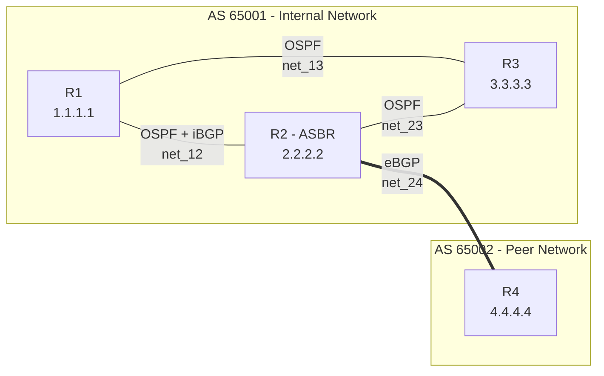

# Blueprint — Network Automation Lab
**Technical Architecture Document**  
Author: Ikhlas Retbi · Version: 1.0

---

## 1. Executive Summary

This document describes the architecture of a 4-router network lab demonstrating OSPF + BGP routing protocols, fully containerized with Docker and monitored by a custom Python automation layer.

The lab simulates an ISP edge scenario where an internal Autonomous System (AS65001) connects to a peer AS (AS65002) via eBGP, while internally using OSPF for IGP and iBGP for external route propagation.

---

## 2. Design Goals

| Goal | Rationale |
|------|-----------|
| Zero cost | Open-source tools only, runs on any laptop |
| Production-relevant | FRR is used by Cloudflare, Deutsche Telekom, Sonic |
| Reproducible | One command to deploy: `docker-compose up -d` |
| Demonstrate automation | Python collects state and generates reports |
| Portfolio-ready | Real evidence of working OSPF/BGP, not screenshots from a tutorial |

---

## 3. Topology Diagram

---

## 4. Routing Protocol Design

### 4.1 OSPF (Internal — AS65001)

- All three internal routers (R1, R2, R3) participate in OSPF area 0
- Router IDs: 1.1.1.1, 2.2.2.2, 3.3.3.3 (loopback convention)
- ECMP enabled by default — R1 reaches `172.21.0.0/16` via both R2 and R3 paths
- DR/BDR election occurs on each broadcast segment

### 4.2 iBGP (R1 ? R2)

- Both routers in AS 65001
- Used for propagating external (eBGP-learned) routes inside the AS
- Same AS in `remote-as` configuration

### 4.3 eBGP (R2 ? R4)

- R2 in AS65001, R4 in AS65002
- Different AS in `remote-as` configuration
- AS-PATH is prepended on each AS hop

---

## 5. Why this design

| Decision | Alternative considered | Reason chosen |
|----------|------------------------|---------------|
| FRR | Cisco IOSv | FRR is free, open-source, and used in production by major ISPs |
| Docker Compose | GNS3 / EVE-NG | Lower resource footprint, easier to version-control, true production pattern |
| Python subprocess | Netmiko / NAPALM | Demonstrates first-principles understanding without library magic |
| HTML report | JSON only | Recruiter-readable visual output |

---

## 6. Verification Methodology

After convergence (~15 seconds), the following must hold:

1. **OSPF**: All internal neighbors in `Full` state — confirmed via `show ip ospf neighbor`
2. **iBGP**: R1 ? R2 session established with non-zero uptime
3. **eBGP**: R2 ? R4 session established with non-zero uptime
4. **Connectivity**: R2 can ping R4 across the inter-AS link
5. **ECMP**: R1 has two equal-cost paths to `172.21.0.0/16`

All five conditions are validated by `scripts/network_monitor.py` and captured in `docs/proof-*.txt`.

---

## 7. Limitations & Future Work

- **No route redistribution** between OSPF and BGP yet — possible enhancement
- **No prefix filtering / route maps** — current eBGP accepts all (Policy)
- **No loopback interfaces** for BGP peering — currently using physical IPs
- **No BFD** for fast failure detection — could be added for sub-second convergence
